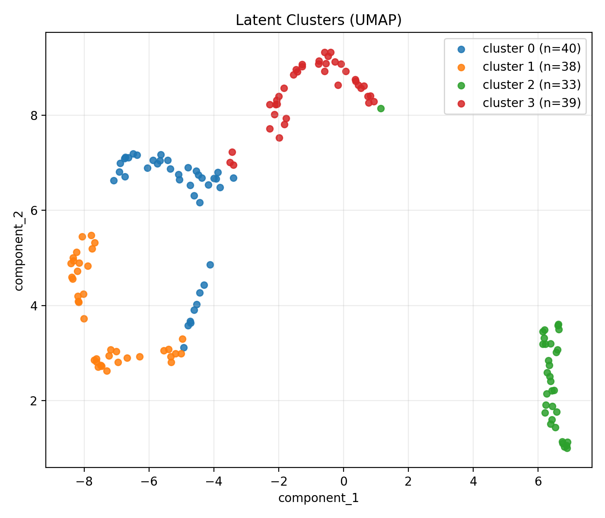
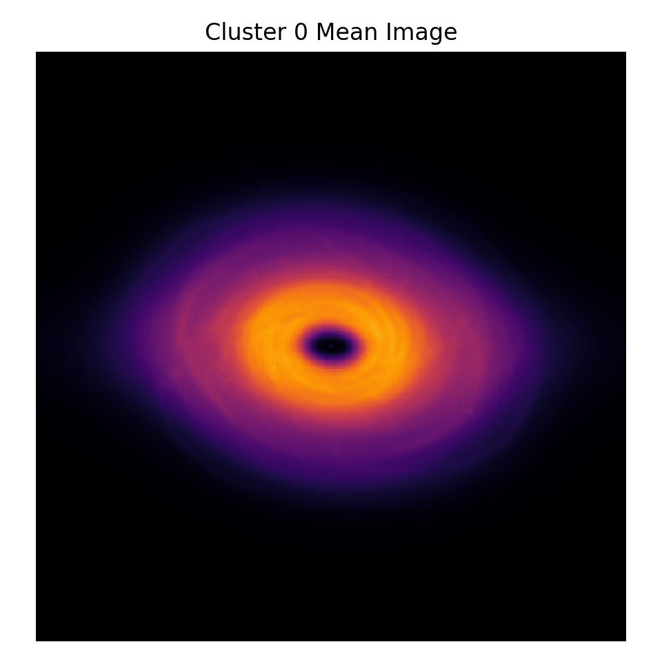

# EXXA GSoC 2026 — Representation Learning for Astronomical Data

## Overview

This project tackles two tasks:

- **General Test**: Unsupervised clustering of protoplanetary disk images
- **Sequential Test**: Transit detection from synthetic light curves

The focus is on learning **meaningful representations**, not just fitting models.

---

## Key Idea

> Good clustering requires geometry-aware representations, not just reconstruction.

We compare:

- Autoencoder (reconstruction-based)
- Contrastive learning (SimCLR)

---

## Results (General Test)

| Method | Silhouette |
|--------|-----------|
| Autoencoder (Phase 2) | 0.362 |
| SimCLR (Phase 3, 3 epochs) | **0.459** |

- Clear improvement in cluster separability  
- Better morphological grouping  

---

## Critical Insight

> Longer contrastive training hurts clustering

- 3 epochs → best  
- 5+ epochs → degradation  

**Reason**

Contrastive learning increasingly focuses on instance discrimination,
which conflicts with clustering objectives.

---

## Experiment Progression (General Test)

We followed a two-stage approach:

### Phase 2 — Autoencoder baseline
- Objective: reconstruction
- Result: silhouette = 0.362

### Phase 3 — Contrastive learning (SimCLR)
- Objective: instance discrimination
- Result: silhouette = 0.459 (best at 3 epochs)

### Key Finding

Early-stage contrastive representations capture global structure,  
while longer training overfits to instance identity and degrades clustering.

---

## Visualization

### UMAP projection



### Cluster mean examples



---

## Final Selected Models

### General Test
- Phase 2: `ae_log_latent128_l2_best`
- Phase 3: `simclr_rot15_flip_e3_best` (final model)

### Selection Criteria
- Quantitative: silhouette score
- Qualitative: UMAP separation and cluster consistency

---

## Experiment Artifacts Structure

Each experiment follows a consistent structure:

    experiments/<phase>/<experiment_name>/
    ├── checkpoints/     # trained model weights
    ├── train/           # training logs and visualizations
    ├── latents/         # extracted feature representations
    ├── clusters/        # clustering results and analysis

### Example

    General_Test/experiments/phase3/simclr_rot15_flip_e3_best/

    ├── checkpoints/
    │   └── best_contrastive.pt

    ├── train/
    │   ├── loss_curve.png
    │   └── train_history.json

    ├── latents/
    │   ├── latent_vectors.npy
    │   └── latent_metadata.csv

    ├── clusters/
    │   ├── umap.png
    │   ├── cluster_*_mean.png
    │   └── cluster_summary.json

---

## Repository Structure

    General_Test/
    ├── experiments/
    │   ├── phase2/
    │   └── phase3/

    Sequential_Test/
    ├── outputs/

    archive/
    data/

---

## Directory Details

### General_Test/
- `src/` : training, feature extraction, clustering
- `experiments/` : final selected experiments only
- `run_*.sh` : reproducible experiment scripts

### Sequential_Test/
- `src/` : training and evaluation pipeline
- `outputs/` : results (figures, metrics, predictions)

### data/
- FITS files (excluded via `.gitignore`)

### archive/
- old or exploratory experiments (not part of final results)

---

## Quick Start

### General Test (best model)

cd General_Test

# extract latents
```bash
python src/extract_contrastive_latents.py \
  --data_dir ../data/fits \
  --checkpoint_path experiments/phase3/simclr_rot15_flip_e3_best/checkpoints/best_contrastive.pt \
  --output_dir experiments/phase3/simclr_rot15_flip_e3_best/latents \
  --preprocess_mode log_minmax \
  --lower_percentile 1.0 \
  --upper_percentile 99.5 \
  --l2_normalize_latents
```

# clustering
```bash
python src/cluster.py \
  --latent_path experiments/phase3/simclr_rot15_flip_e3_best/latents/phase3/simclr_rot30_latent128/latents/latent_vectors.npy \
  --metadata_csv experiments/phase3/simclr_rot15_flip_e3_best/latents/phase3/simclr_rot30_latent128/latents/latent_metadata.csv \
  --metadata_json experiments/phase3/simclr_rot15_flip_e3_best/latents/phase3/simclr_rot30_latent128/latents/latent_metadata.json \
  --output_dir experiments/phase3/simclr_rot15_flip_e3_best/clusters \
  --phase phase3 \
  --n_clusters 4
```

---

## Notes

- Raw FITS data (`data/fits/`) is excluded via `.gitignore`
- Large artifacts (outputs, checkpoints) are not tracked

---

## Reproducibility

See:

- `General_Test/README.md`  
- `Sequential_Test/README.md`  

---

## Conclusion

Contrastive learning improves clustering —  
but only when stopped early.